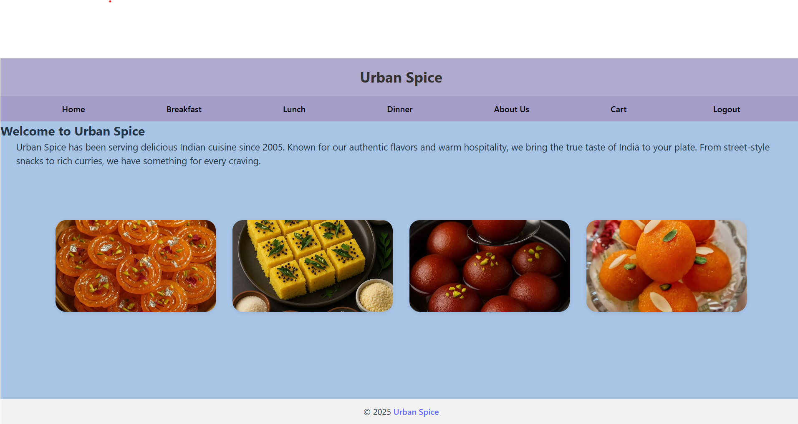
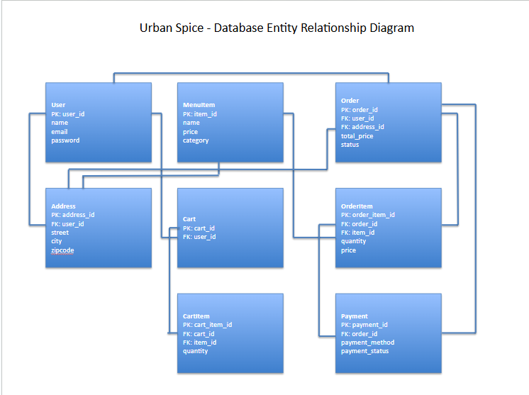

**Urban Spice🌶 – Indian Vegetarian Food Ordering App🥘**

 **Project👩🏽‍🍳 Overview**

Urban Spice is a full-stack online food-ordering application focused on 100% vegetarian Indian cuisine.
It provides a reliable, user-friendly space for customers — including vegetarians, vegans, people with egg allergies, and non-vegetarians who enjoy lighter, flavorful Indian food.

Users can browse meals by category (Breakfast, Lunch, Dinner), add items to the cart, enter their delivery address, choose payment method, and place an order.

This project was created as part of LaunchCode Unit-2 Full Stack Coursework, demonstrating React, Spring Boot, MySQL, and RESTful API integration.

📷 

🔧 **Technologies Used**
Frontend

React (Functional Components + Hooks)

React Router DOM

CSS with Flexbox, Grid & Media Queries

Fetch API for backend calls

Backend

Java 21

Spring Boot

Spring Web

Spring Data JPA / Hibernate

MySQL Database

🔧Tools

IntelliJ IDEA (Backend development)

VS Code (Frontend development)

MySQL Workbench

Git & GitHub

Postman (API testing)

**📃Features**
**Frontend Features**

Home page with category navigation

Responsive UI (mobile/tablet/desktop)

Add to cart functionality

Update cart item quantity

Delete cart item

Cart total auto-updates

Login / Logout (LocalStorage)

Address form with validation

Payment preference selection

Backend Features

Fully implemented CRUD endpoints

Login authentication (email + password)

Cart auto-creation per user

Cart item quantity updates

Order + OrderItems + Payment system

Menu seeding on startup

JOINS across MenuItem, CartItem, Cart, User, Address, Orders

📊 **ER Diagram**

📡 API Endpoints

## 🍽️ Menu Item APIs

| **Method** | **Endpoint** | **Description** |
|-----------|--------------|-----------------|
| GET | `/api/menuitems/category/{category}` | Fetch menu items by category (breakfast, lunch, dinner) |

## 🛒 Cart APIs

| **Method** | **Endpoint** | **Description** |
|-----------|--------------|-----------------|
| GET | `/api/carts/user/{userId}` | Get or create cart for the logged-in user |
| PUT | `/api/carts/updateQuantity/{cartItemId}?quantity=x` | Update quantity of a cart item |
| DELETE | `/api/carts/removeItem/{cartItemId}` | Remove an item from the user's cart |

## 👤 User Authentication APIs

| **Method** | **Endpoint** | **Description** |
|-----------|--------------|-----------------|
| POST | `/api/users/login` | Login user and return user details |
| POST | `/api/users/register` | Register a new user |

## 💵 Payment APIs

| **Method** | **Endpoint** | **Description** |
|-----------|--------------|-----------------|
| POST | `/api/payments` | Create a payment entry (Pay on Delivery / Pay Now) |

 
 
 
 👷‍♂️ **Installation Instructions**
**Backend Setup (Spring Boot)**

**Clone the repository:**

git clone https://github.com/poojapandey305/unit-2-project-repo-name.git

**Navigate to backend folder:**

cd java-spring-boot-back-end-app

Configure application.properties with your MySQL username/password.

**Run the Spring Boot app:**

mvn spring-boot:run

**Backend will run at:**

http://localhost:8080

**Frontend Setup (React)**

**Navigate to frontend:**

cd react-front-end-app

**Install dependencies:**

npm install

**Start the app:**

npm run dev

**Frontend runs at:**

http://localhost:5173

🚀**Future Enhancements**

Online payment gateway (Stripe/PayPal)

Order history for each user

Admin panel to manage menu items

User registration page connected to backend

Live order status updates

Add recommended meals / popular items section

👩🏽‍💻 **Author**

**Pooja Pandey**

LaunchCode Full-Stack Student
GitHub: poojapandey305
